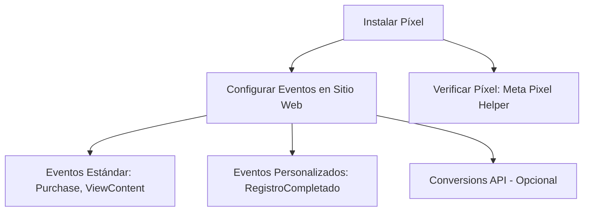

# Tutorial: Pasos para Configurar Campañas en Facebook Ads (Basado en Apuntes Originales)

Este documento describe los pasos exactos para configurar campañas en el Administrador de Anuncios de Facebook, crear públicos personalizados con píxel y lanzar anuncios, según los apuntes originales. Está diseñado para guiarte directamente a las funcionalidades clave, sin explicaciones adicionales, y es compatible con Obsidian.

---

## 1. Acceder al Administrador de Anuncios

1. Abre [facebook.com/adsmanager](https://www.facebook.com/adsmanager).
2. Inicia sesión con tu cuenta de Facebook.
3. (Opcional) Si gestionas múltiples cuentas, ve a [business.facebook.com](https://business.facebook.com) y selecciona tu cuenta publicitaria.

---

## 2. Crear una Campaña

1. En **Ads Manager**, haz clic en **Crear** (botón verde).
2. Selecciona un objetivo:
   - Ventas
   - Interacción
   - Clientes Potenciales
   - Reconocimiento
3. En **Nombre de la Campaña**, escribe un nombre (ejemplo: "Ventas_Mayo_2025").
4. En **Tipo de Compra**, selecciona **Subasta**.
5. En **Presupuesto**, elige **Diario** o **Total**. Ejemplo: $10/día.
   - (Recomendación) Divide en dos campañas: 70% presupuesto en la primera ($7), 30% en la segunda ($3).
6. En **Estrategia de Puja**, selecciona **Volumen más Alto**.
7. Haz clic en **Siguiente**.

---

## 3. Configurar Conjunto de Anuncios

1. En **Nombre del Conjunto de Anuncios**, escribe un nombre (ejemplo: "Ventas_Sitio_Web").
2. En **Ubicación de la Conversión**, selecciona **Sitio Web**.
3. En **Objetivo de Rendimiento**, elige **Maximizar el Número de Conversiones**.
4. En **Conjunto de Datos**, selecciona tu píxel (configurado en la sección 4).
5. En **Evento de Conversión**, elige una acción (ejemplo: Compra, Registro, Agregar al Carrito).
6. En **Presupuesto y Calendario**:
   - Establece fechas (ejemplo: 20-30 mayo).
   - Selecciona horas (ejemplo: 8 AM-10 PM).
7. En **Público**:
   - **Lugares**: Selecciona países/ciudades (ejemplo: México, Ciudad de México).
   - **Edad y Sexo**: Define rango (ejemplo: 25-34, mujeres).
   - **Segmentación Detallada**: Añade intereses (ejemplo: moda, fitness).
   - (Opcional) Selecciona público personalizado o similar (creado en la sección 4).
8. En **Ubicaciones**, selecciona **Automáticas** (recomendado).
9. Haz clic en **Siguiente**.

---

## 4. Crear Público Personalizado con Píxel

### 4.1. Instalar Conjunto de Datos (Antes llamado "Píxel")
1. Ve a **Business Manager** ([business.facebook.com](https://business.facebook.com)).
2. Navega a **Todas las herramientas** > **Configuración de Negocio** > **Orígenes de Datos** > **Conjunto de datos.**
3. Haz clic en **Agregar**.
4. Nombra el píxel (ejemplo: "TiendaX_Pixel").
5. Asígnale una persona y dale sus permisos (recomendablemente de administrador)
6. Copia el código del píxel y pégalo en el `<head>` de tu sitio web.
7. (Opcional) Genera un **Token de Acceso**:
   - Ve a **Administrador de Eventos** > selecciona tu píxel > **Configuración** > **Generar Token de Acceso**.
   - Ejemplo:
```javascript
EAAgPZQwXy9kBOz7TjKnRfLmV2HsYpQR8mX3JtN4vW9uB2cZkHsG9qL5JrTfX8nPqW4vRtY2mZBx6K9vCnJ3mF8sT2QwL9pY7HsV4rM3kZCzX2nB5tY8qW3JrN6vPqT9mL8kZ2rY5nT3mX7vW9uB2cZkHsG9qL5JrTfX8nPqW4vRtY2mZDZD
```
1. Verifica el píxel con **Meta Pixel Helper** (extensión de Chrome).


#### 4.1.2. Configurar Eventos para el Píxel

1. Asegúrate de que el píxel esté instalado en tu sitio web (ver sección 4.1).
2. Agrega código para eventos estándar o personalizados:
   - **Eventos Estándar** (ejemplo: Purchase):
 ```javascript
 fbq('track', 'Purchase', {value: 100.00, currency: 'USD'});
 ```
   - **Eventos Personalizados** (ejemplo: Registro Completado):
 ```javascript
 fbq('trackCustom', 'RegistroCompletado', {userType: 'nuevo'});
 ```
   - Inserta el código en las páginas relevantes (ejemplo: página de confirmación de compra).
3. (Opcional) Usa **Conversions API** para eventos server-side:
   - Ve a **Business Manager** > **Configuración de Negocio** > **Orígenes de Datos** > **Píxeles**.
   - Selecciona tu píxel > **Configuración** > **Configurar Conversions API**.
   - Sigue las instrucciones en [Meta Conversions API](https://developers.facebook.com/docs/marketing-api/conversions-api/).
4. Prueba los eventos:
   - Ve a **Administrador de Eventos** ([facebook.com/events_manager](https://www.facebook.com/events_manager)).
   - Selecciona tu píxel > **Prueba de Eventos**.
   - Navega por tu sitio web (ejemplo: haz una compra) y verifica que los eventos aparezcan.
1. Regresa a la sección 4.2 para crear el público personalizado.


### 4.2. Crear Público Personalizado
1. En **Ads Manager**, ve a **Públicos** (menú lateral).
2. Haz clic en **Crear Público** > **Público Personalizado** > **Sitio Web**.
3. Selecciona tu píxel.
4. Elige un evento.
	1. Estos eventos se ven limitados si no se completa el paso 4.1.2; solo hay 3 eventos default. Puedes elegir "**Todos los eventos**" si todavía no generas eventos personalizados.
5. Define rango de tiempo (ejemplo: últimos 30 días).
6. Nombra el público (ejemplo: "Visitantes_Sitio_30d").
7. Haz clic en **Crear**.

### 4.3. Crear Público Similar
1. En **Públicos**, haz clic en **Crear Público** > **Público Similar**.
2. Selecciona el público personalizado (ejemplo: "Visitantes_Sitio_30d").
3. Elige país/región (ejemplo: México).
4. Ajusta tamaño (1% para mayor similitud, hasta 10% para alcance).
	1. Recomendable dejarlo en 1% al empezar y 10% cuándo la marca sea más famosa
5. Nombra el público (ejemplo: "Lookalike_Visitantes_1%").
6. Haz clic en **Crear**.

---

## 5. Configurar Anuncio

1. En **Campañas** > **Eliges tu campaña** > **Opción "Editar"** >  **Click en "Anuncio" en la parte superior** 
2. **Nombre del Anuncio**, escribe un nombre (ejemplo: "Anuncio_Video_Mayo").
3. En **Página**, selecciona tu página de Facebook e Instagram.
4. En **Formato**, elige **Una sola imagen o video**.
5. En **Contenido del Anuncio**:
   - Sube imagen o video (recomendado: 16-20 segundos).
   - Incluye **URL** del sitio/producto.
   - Añade **Texto Principal** (ejemplo: "¡Nueva colección, 20% off!").
   - (Opcional) Ajusta video: corta segmentos, usa formato vertical (9:16).
   - Activa **Mejoras IA** (retoques visuales, catálogo si aplica).
5. En **Etiquetas de Información**, añade:
   - Envío gratuito, opciones de pago, devoluciones, etc.
   - Información de cuenta (ubicación, horarios, calificaciones).
6. En **Destino**, verifica la URL del anuncio.
7. En **Seguimiento**, asegura que el píxel esté activado.
8. Haz clic en **Publicar**.

---

## 6. Crear Campaña para Público Frío

1. En **Campañas**, selecciona tu campaña > **Editar**.
2. En el conjunto de anuncios (Barra lateral izquierda),  busca tu anuncio actual
3. Haz clic en los **tres puntos** > **Duplicar**.
4. En el nuevo conjunto, ve a **Público** > **Segmentación Detallada** y elimina intereses previos.
5. En **Públicos Personalizados**, selecciona **Crear Público Similar**.
6. Elige origen (ejemplo: público personalizado o Instagram).
7. Configura país y tamaño (ejemplo: México, 1%).
8. Nombra el público (ejemplo: "Lookalike_Instagram_1%").
9. Haz clic en **Crear** y **Publicar**.

---

## 7. Optimizar y Duplicar Anuncios

1. En **Ads Manager**, selecciona tu campaña.
2. Navega al conjunto de anuncios > selecciona el anuncio.
3. Haz clic en los **tres puntos** > **Duplicar**.
4. Modifica elementos (imagen, texto, público) para pruebas A/B.
5. Repite pasos de la sección 5 para cada nuevo anuncio.
6. Publica y monitorea en **Ads Manager** (clics, conversiones).

---

## Diagrama Mermaid: Flujo de Configuración

```mermaid
graph TD
    A[Acceder Ads Manager] --> B[Crear Campaña: Objetivo, Subasta]
    B --> C[Configurar Conjunto: Público, Píxel, Conversión]
    C --> D[Instalar Píxel: Sitio Web]
    D --> E[Crear Público Personalizado: Visitas, Compras]
    E --> F[Crear Público Similar: Lookalike]
    C --> G[Configurar Anuncio: Video, Texto, URL]
    G --> H[Publicar y Duplicar: Pruebas A/B]
    H --> I[Monitorear Resultados]
````